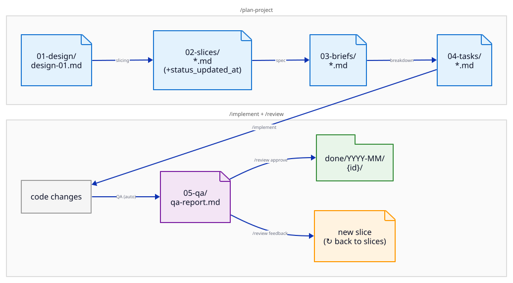
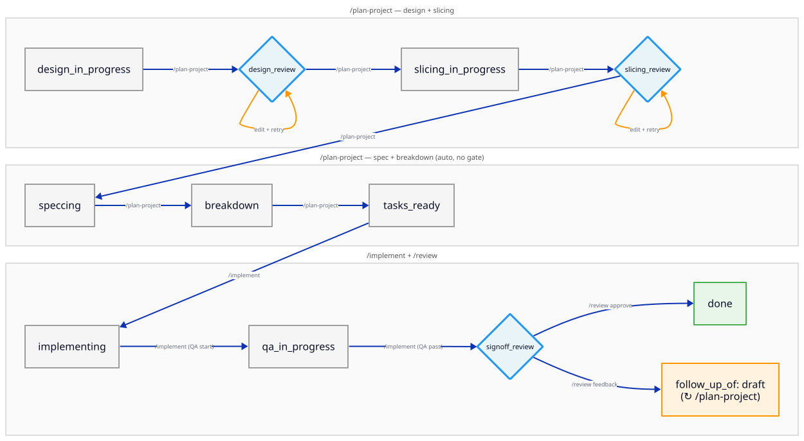
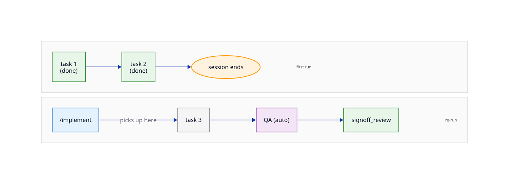
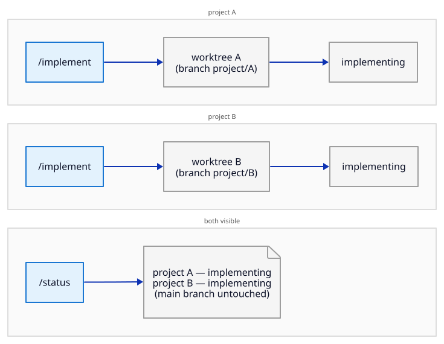
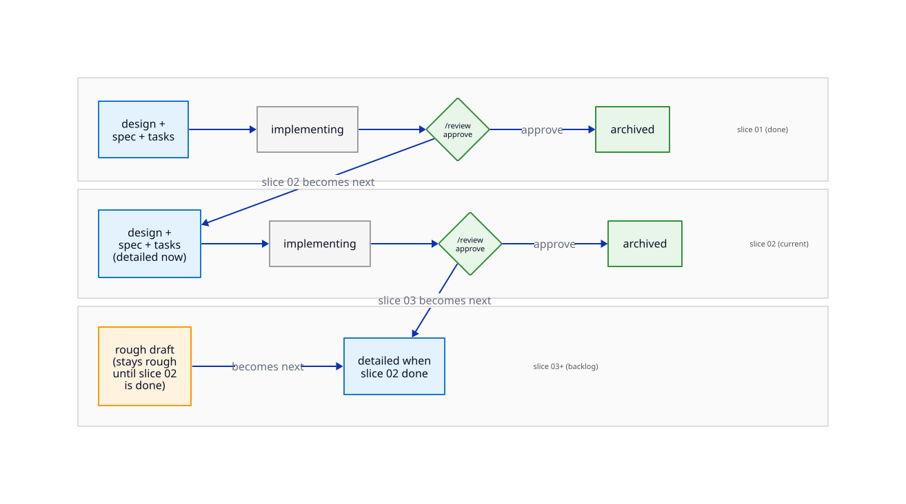
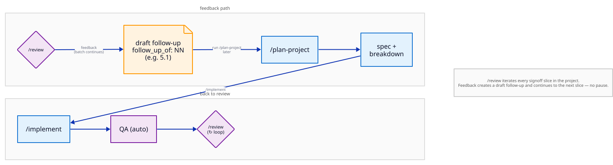

# command-init-orchestrator

Run `/init-orchestrator` in any git repo. You get a 4-command system for taking ideas from design through implementation to signoff — with structured planning, isolated execution, and human review at the points that matter.

## Why use it

**Single source of truth.** Every project artifact — design doc, slices, briefs, tasks, QA reports — lives in `.orchestration/projects/{id}/`. One folder. Nothing scattered.

**Docs stay in sync.** Design decisions flow through structured stages with committed artifacts at each gate. When a later stage reshapes something, the upstream doc gets updated before moving on. The system makes it harder to let docs go stale than to keep them current.

**Slicing discipline built in.** Work is planned as thin vertical slices — something observable and testable on its own. Small slices mean you validate assumptions early and fail cheap, not at the end.

**Status that reflects reality.** `status.md` is the ground truth for every project. `/status` gives you a table of all active projects, their stage, their worktree, and how long they've been there. Replaces JIRA-level tracking without needing JIRA.

**Work isolation by default.** Each `/implement` creates a git worktree on a dedicated branch — isolated working directory, no interference between projects. Multiple projects can run concurrently. Main stays clean for planning.

**Human gates where they matter.** Gates exist after design, slicing, spec, and QA. Not after every step. The system trusts mechanical work and gates judgment calls.

**QA is a first-class citizen.** QA runs automatically at the end of every implementation slice. You can customize what it checks. Nothing reaches signoff without it.

**Project scaffold, not a server.** `/init-orchestrator` installs a scaffold you own — command files in `.claude/commands/`, project structure in `.orchestration/`. Tweak commands, add root context, modify QA checks. No singleton to update, no breaking API.

---

## The 4 commands

| Command | What it does |
|---------|-------------|
| `/design` | Full planning pipeline: design interview → slicing → spec → breakdown. Stops when tasks are ready. Commits at each human approval gate. |
| `/implement` | Execution pipeline: creates a git worktree, runs tasks sequentially, runs QA automatically. Stops at signoff for human review. Nothing committed until `/review` approves. |
| `/review` | Closes the loop: approve (commits everything, merges branch, archives project) or provide feedback (adds new slices to backlog). |
| `/status` | All active projects in a table: stage, worktree, next action, time in stage. Plus a done-this-week recap. |

---

## Core concepts

**Slices** are the unit of work. A slice is a thin vertical cut — something someone can observe and verify that it improves the state of the system, even if we had to stop here. You typically plan one slice at a time, implement it, review it, then move to the next. Slices 02+ can be intentionally rough until they become next; implementation reshapes future slices.

**Worktrees** isolate execution. Each `/implement` creates a git worktree at `.orchestration/worktrees/{id}` on branch `project/{id}`. Multiple projects can run in parallel — each on its own branch. Main stays clean.

**Human gates** exist at design review, slicing review, spec review, and QA signoff. Nothing advances past a gate without a human re-running the command. Between gates, the system runs autonomously.

---

## Quick start

```
1. /design — describe what you want to build
2. Review the design doc, edit if needed, iterate until it's right
   Approve: re-run /design to continue to slicing
3. Review slice 01, iterate
   Approve: generates the spec (implementation plan)
4. Review the spec — light pass, the heavy lifting is in design and slicing
   Approve: breaks the spec into tasks
5. /implement — confirm agent team, tasks run automatically through QA
6. /review — approve or provide feedback
   Approve: commits and archives
   Feedback: creates a follow-up slice to iterate further
```

Run `/status` at any point to see where everything stands.

---

## How a project flows

What gets created at each stage — design doc through archived output:



Every project moves through these stages, with human review gates and retry loops:



---

## Common patterns

A few patterns worth knowing before you hit them in the wild.

**Pause and resume** — interrupt mid-implementation, re-run picks up from the last completed task:



**Concurrent projects** — two projects running in parallel on separate worktree branches, both visible in `/status`:



**Multi-slice sequence** — backlog advancing in order; future slices stay rough until they become next:



**Feedback loop** — `/review` feedback creates a new slice, which flows back through design and implementation:



**Project folder layout** — every artifact for a project lives under one directory:

```
.orchestration/projects/{id}/
├── 01-design/          ← design doc (written during /design interview)
├── 02-slices/          ← slice files (one per unit of work)
├── 03-briefs/          ← delegation briefs (one per specced slice)
├── 04-tasks/           ← task files, organised by slice
│   └── slice-01/
├── 05-qa/              ← QA reports (written automatically after /implement)
└── status.md           ← ground truth: current stage, transitions, worktree path

.orchestration/projects/done/YYYY-MM/{id}/   ← archived after /review approve
```

---

## Install

```bash
/init-orchestrator
```

Installs `design.md`, `implement.md`, `review.md`, `status.md` into `.claude/commands/`.
Creates `.orchestration/projects/` and `.orchestration/worktrees/` (gitignored).

Safe to re-run — adds missing components without touching existing ones, telling you if they've drifted and if you want to hard replace, handle it yourself, or try to merge automatically.

---

## Customization

The system is a scaffold, not a service. Everything is a file you own.

**Two sets of command files:**

- `.claude/commands/` — the local install. Edits here affect only this repo. Use this to tweak behavior for a specific project.
- `defaults/commands/` — the source that gets copied on `/init-orchestrator` install. Edits here ship to anyone who installs or re-runs the command.

To update a command for everyone: edit `defaults/commands/`, then re-run `/init-orchestrator` in any project to pick up the change.

To add project-specific context: drop a `CLAUDE.md` at your project root or add files to `.root-context/`. Commands read these automatically before starting.
